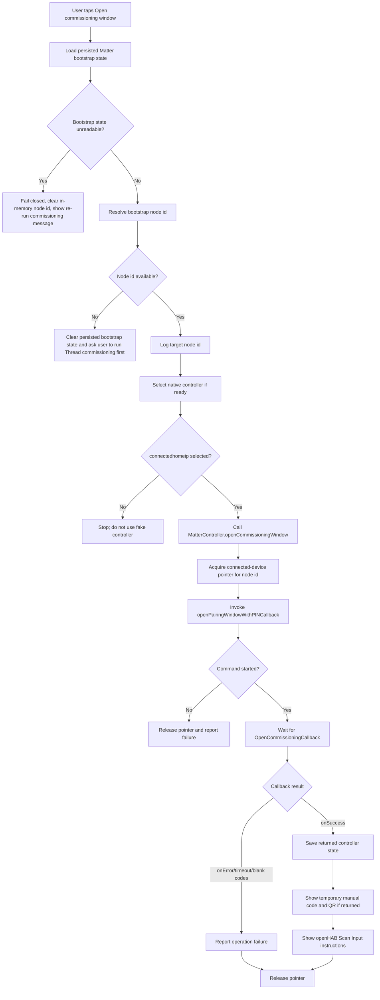
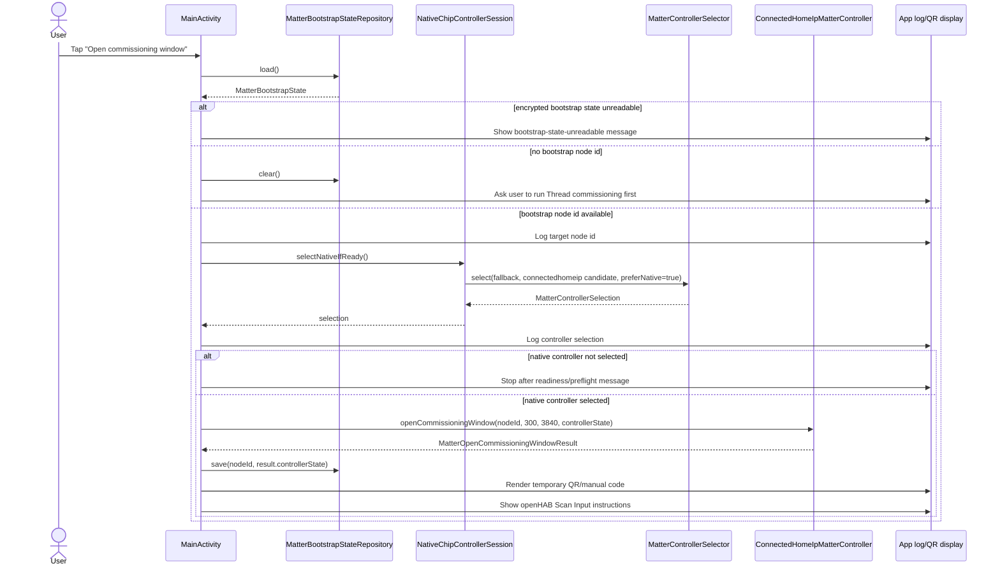
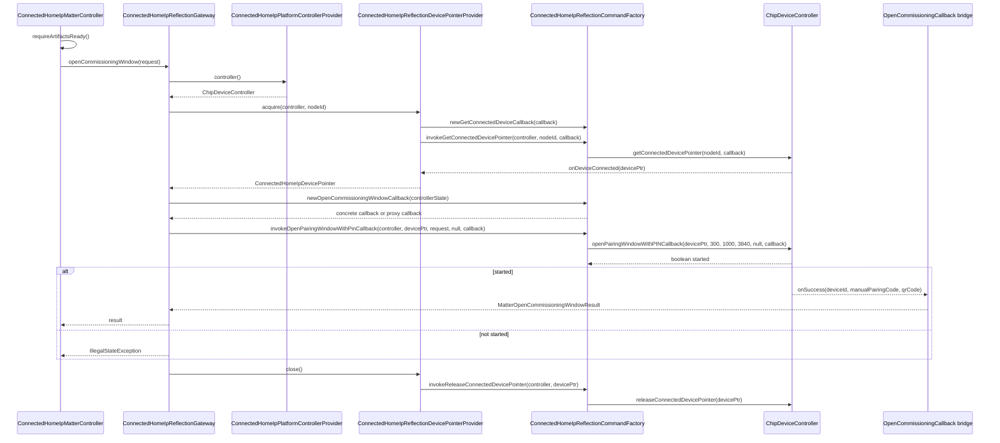
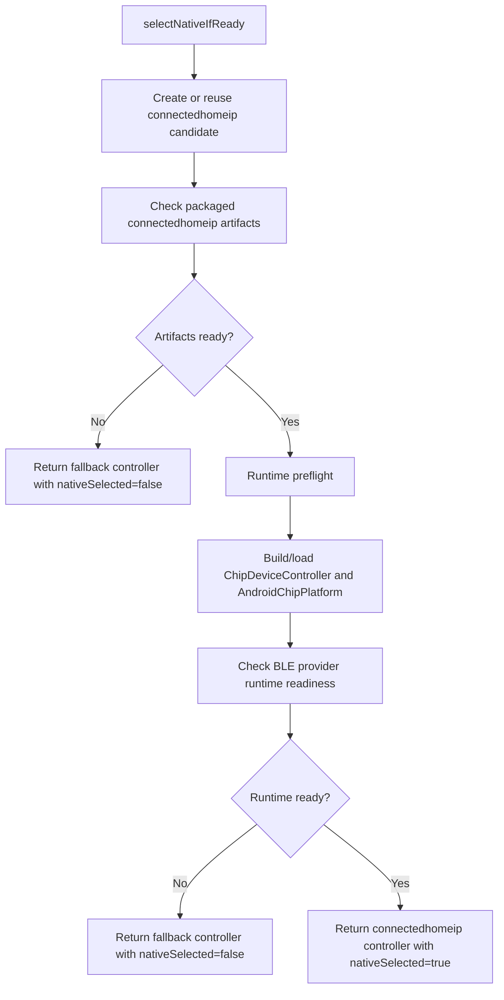
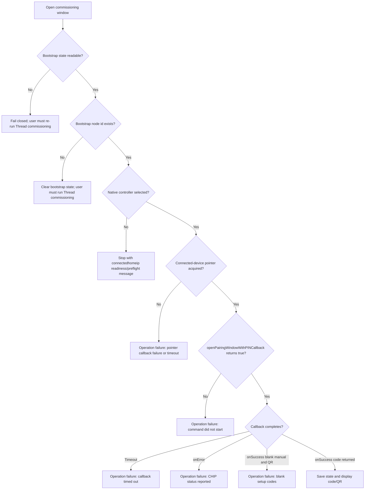

# Open Commissioning Window Workflow

This documents the current Android app flow for opening a Matter commissioning window on a device that the phone has already commissioned as the bootstrap controller.

## Summary

The app no longer opens an OpenCommissioningWindow through the simulated controller. The user must first run Thread commissioning successfully so the app has a bootstrap Matter node id and connectedhomeip controller state. When the user taps **Open commissioning window**, the app reloads the persisted bootstrap state, selects the connectedhomeip Java controller only if packaged artifacts and runtime preflight are ready, asks connectedhomeip for a connected-device pointer, invokes `openPairingWindowWithPINCallback`, waits for the callback, then displays the temporary manual setup code and QR code when one is returned.

Important current parameters:

| Parameter | Current value | Where set |
| --- | ---: | --- |
| Window timeout | `300` seconds | `MainActivity.runOpenCommissioningWindow()` |
| Discriminator | `3840` | `MainActivity.runOpenCommissioningWindow()` |
| Enhanced commissioning iteration | `1000` | `ConnectedHomeIpMatterController` |
| Setup PIN passed to CHIP API | `null` | `ConnectedHomeIpReflectionGateway` |
| Device-pointer wait timeout | `300_000` ms | `ConnectedHomeIpMatterControllerFactory` |
| OCW callback wait timeout | `300_000` ms | `ConnectedHomeIpReflectionGateway` |

## High-Level Flow

## App/UI Sequence

## connectedhomeip Command Sequence

## Readiness Gate

The calling UI checks `nativeSelected()`. If it is false, the OCW workflow stops after logging the selection message. This is intentional: OpenCommissioningWindow does not silently fall back to `FakeMatterController`.

## Failure Paths

## Source Map

| Area | Main classes |
| --- | --- |
| UI entry point and result display | `MainActivity.runOpenCommissioningWindow()`, `MainActivity.showTemporaryQrCode()` |
| Bootstrap state resolution | `MatterBootstrapStateRepository`, `MatterBootstrapStateResolver`, `MatterBootstrapState` |
| Native-controller gate | `NativeChipControllerSession`, `MatterControllerSelector`, `ConnectedHomeIpMatterControllerFactory` |
| connectedhomeip controller facade | `ConnectedHomeIpMatterController` |
| CHIP command orchestration | `ConnectedHomeIpReflectionGateway` |
| Connected-device pointer lifecycle | `ConnectedHomeIpReflectionDevicePointerProvider`, `ConnectedHomeIpConnectedDeviceCallback`, `ConnectedHomeIpDevicePointer` |
| Reflected CHIP APIs | `ConnectedHomeIpReflectionCommandFactory` |
| OCW callback/result mapping | `ConnectedHomeIpOpenCommissioningWindowCallback`, `MatterOpenCommissioningWindowResult` |
| openHAB user instructions | `OpenHabInstructions` |
