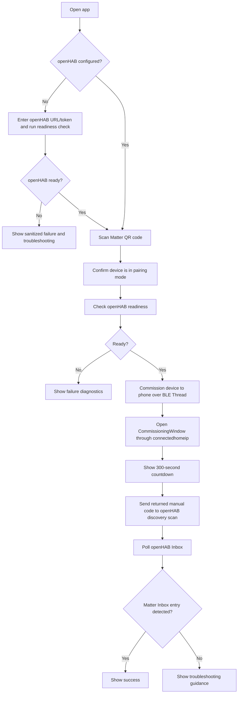
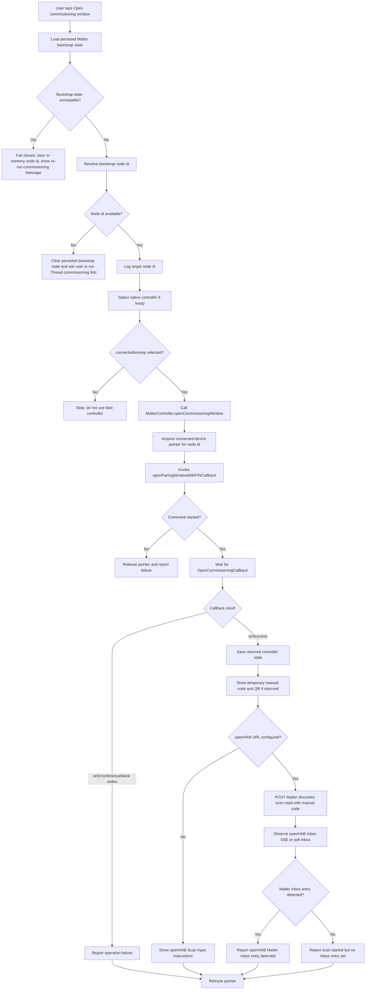
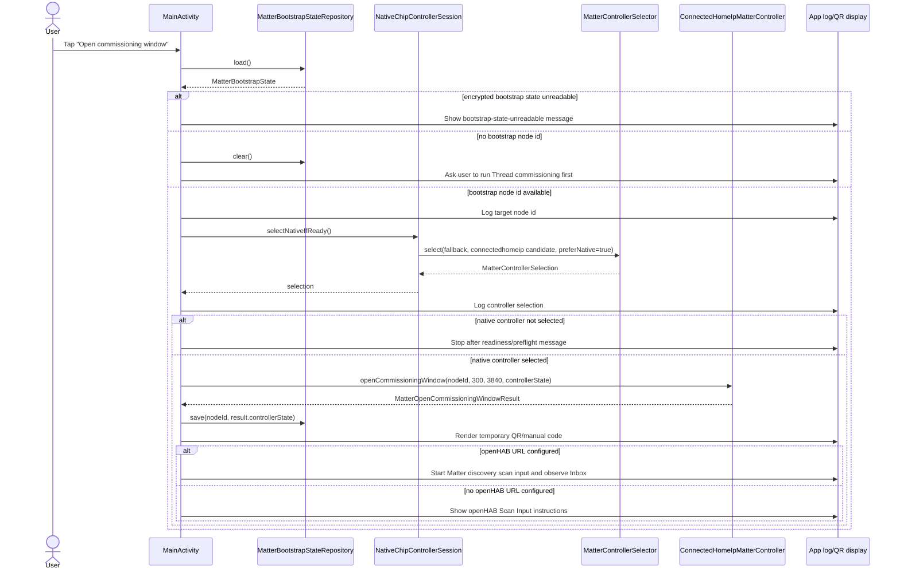
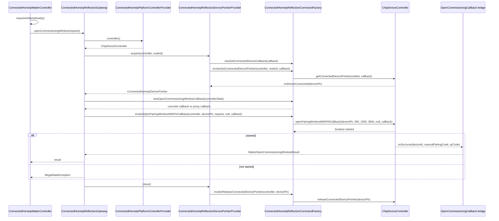
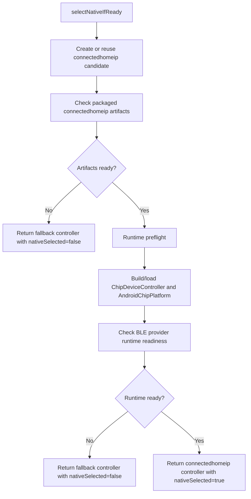
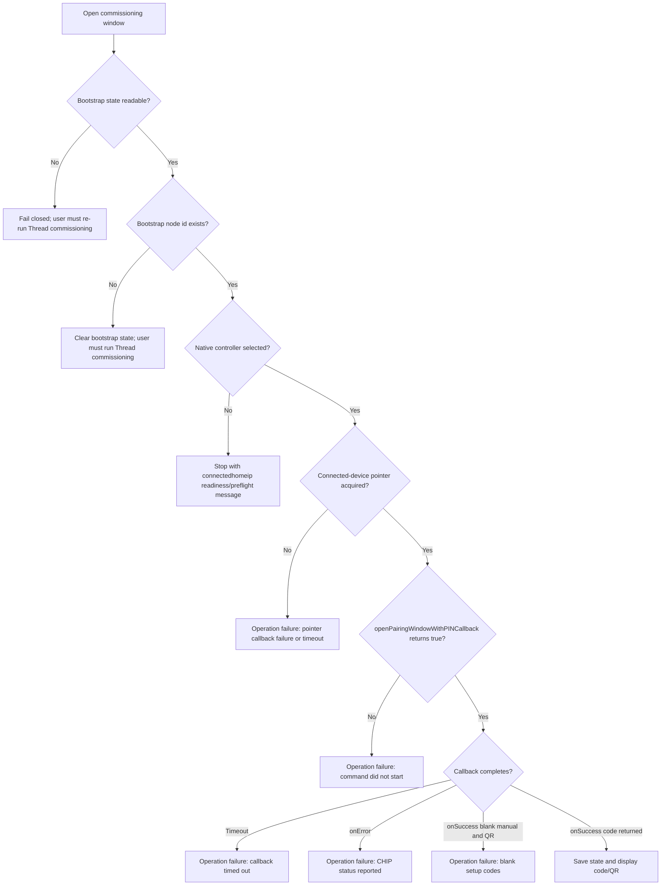

# Open Commissioning Window Workflow

This documents the current Android app flow for opening a Matter commissioning window on a device that the phone has already commissioned as the bootstrap controller.

## Summary

The app no longer opens an OpenCommissioningWindow through the simulated controller. The user must first run Thread commissioning successfully so the app has a bootstrap Matter node id and connectedhomeip controller state. When the user taps **Open commissioning window** in the legacy UI, the app reloads the persisted bootstrap state, selects the connectedhomeip Java controller only if packaged artifacts and runtime preflight are ready, asks connectedhomeip for a connected-device pointer, invokes `openPairingWindowWithPINCallback`, waits for the callback, then displays the temporary manual setup code and QR code when one is returned. When an openHAB base URL is configured, the app automatically posts the returned manual setup code to openHAB Matter discovery scan input and then observes the openHAB Inbox for a Matter entry. If no openHAB URL is configured, the app keeps the manual Scan Input instructions.

The Compose automated setup flow treats OpenCommissioningWindow as an internal step after QR scan, pairing-mode confirmation, and BLE Thread commissioning to the phone. When connectedhomeip returns the manual setup code, the app submits that code to openHAB Matter discovery scan input, starts watching the openHAB Inbox, and reports v1 success only when a Matter Inbox entry is detected. The temporary 300-second pairing window is shown as a countdown in the user-facing progress UI.

Important current parameters:

| Parameter | Current value | Where set |
| --- | ---: | --- |
| Window timeout | `300` seconds | `MainActivity.runOpenCommissioningWindow()`, `MatterSetupViewModel` |
| Discriminator | `3840` | `MainActivity.runOpenCommissioningWindow()`, `MatterSetupViewModel` |
| Enhanced commissioning iteration | `1000` | `ConnectedHomeIpMatterController` |
| Setup PIN passed to CHIP API | `null` | `ConnectedHomeIpReflectionGateway` |
| Device-pointer wait timeout | `300_000` ms | `ConnectedHomeIpMatterControllerFactory` |
| OCW callback wait timeout | `300_000` ms | `ConnectedHomeIpReflectionGateway` |

## Compose Automated Setup Flow

The Compose path is owned by `MatterSetupViewModel`. It uses `MatterSetupWorkflow` and `AndroidMatterSetupPorts` to keep connectedhomeip, REST, storage, and diagnostics outside Compose UI code. `WorkflowExecutionGate` prevents duplicate workflow starts from repeated taps, and the ViewModel suppresses state emissions after it is cleared.

## High-Level Flow

## App/UI Sequence

## connectedhomeip Command Sequence

## Readiness Gate

The calling UI checks `nativeSelected()`. If it is false, the OCW workflow stops after logging the selection message. This is intentional: OpenCommissioningWindow does not silently fall back to `FakeMatterController`.

## Failure Paths

- In the Compose automated flow, if the openHAB scan starts but no Inbox entry is detected before timeout, the app shows recovery guidance for IPv6 routing, OTBR reachability, mDNS/Avahi visibility, stale Matter records, and retrying setup to request a fresh commissioning window.
- The Compose advanced troubleshooting screen is guidance-only for OCW retry and forget-from-phone cleanup today. It does not expose one-tap OCW retry or device removal until those actions are wired to real operations.

## Source Map

| Area | Main classes |
| --- | --- |
| UI entry point and result display | `MainActivity.runOpenCommissioningWindow()`, `MainActivity.showTemporaryQrCode()` |
| Compose automated setup entry point | `MatterSetupActivity`, `MatterSetupViewModel`, `MatterSetupApp` |
| Compose workflow state and ports | `MatterSetupWorkflow`, `MatterSetupStateReducer`, `WorkflowExecutionGate`, `AndroidMatterSetupPorts` |
| Bootstrap state resolution | `MatterBootstrapStateRepository`, `MatterBootstrapStateResolver`, `MatterBootstrapState` |
| Native-controller gate | `NativeChipControllerSession`, `MatterControllerSelector`, `ConnectedHomeIpMatterControllerFactory` |
| connectedhomeip controller facade | `ConnectedHomeIpMatterController` |
| CHIP command orchestration | `ConnectedHomeIpReflectionGateway` |
| Connected-device pointer lifecycle | `ConnectedHomeIpReflectionDevicePointerProvider`, `ConnectedHomeIpConnectedDeviceCallback`, `ConnectedHomeIpDevicePointer` |
| Reflected CHIP APIs | `ConnectedHomeIpReflectionCommandFactory` |
| OCW callback/result mapping | `ConnectedHomeIpOpenCommissioningWindowCallback`, `MatterOpenCommissioningWindowResult` |
| openHAB scan handoff and instructions | `OpenHabMatterDiscoveryClient`, `HttpOpenHabMatterDiscoveryClient`, `OpenHabInstructions` |
